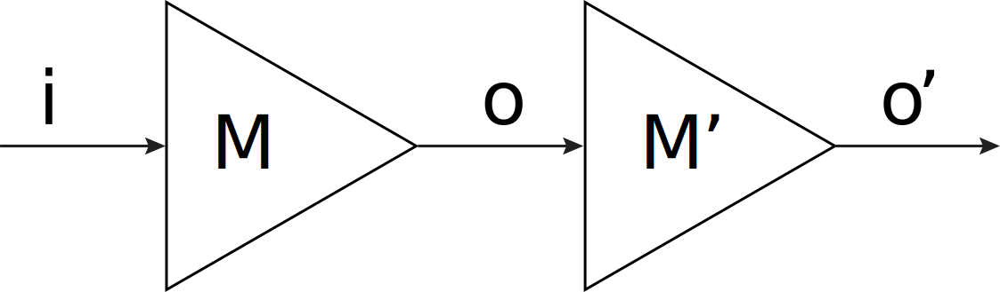
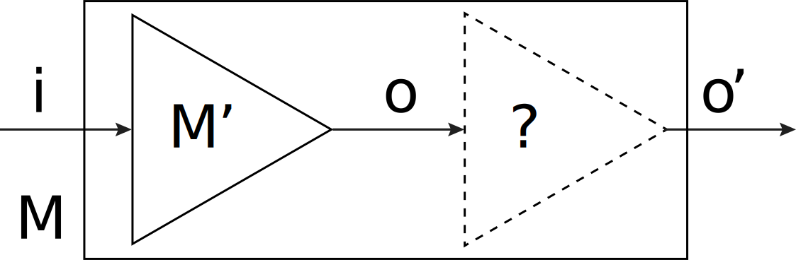

#
<p align="center">

</p>

Pacti is a Python package for carrying out compositional system analysis and design. Pacti represents components in a
system using assume-guarantee specifications, or contracts. Pacti's capabilities include the following:

- Obtaining sensible system specifications from the specifications of the constituent subsystems.
- Computing specifications of subsystems that need to be added to a design in order to meet an objective.
- Verifying whether a component meets a specification.

## Examples


### Composition


Suppose we have the following system:




Components $M$ and $M'$ obey, respectively, contracts $C = (|i| \le 2, o \le i \le 2o + 2)$ and $C' = (-1 \le o \le 1/5, o' \le o)$. We can use Pacti to obtain the specification of the system by executing the command

`pacti examples/example.json result.json`

Pacti places the result of composition in the file result.json. The output is

```
  Composed contract:      
  InVars: [<Var i>]       
  OutVars:[<Var o_p>]     
  A: 5*i <= 1, -1/2*i <= 0
  G: -1*i + 1*o_p <= 0
```

### Quotient


Now we consider an example of quotient. Consider the following circuits:



We wish to implement a system $M$ with specification $C = (|i| \le 1, o' = 2i + 1)$, and to do this we have available a component $M'$ with specification $C' = (|i| \le 2, o = 2i)$. We use the quotient operation in Pacti to obtain the specification of the component that we are missing so that the resulting object meets the specification $C$. We run the command

`pacti examples/example_quotient.json result.json`

And Pacti outputs

```
  Contract quotient:
  InVars: [<Var o>]
  OutVars:[<Var o_p>]
  A: 1*o <= 2, -1*o <= 2
  G: -1*o + 1*o_p <= 1, 1*o + -1*o_p <= -1
```
